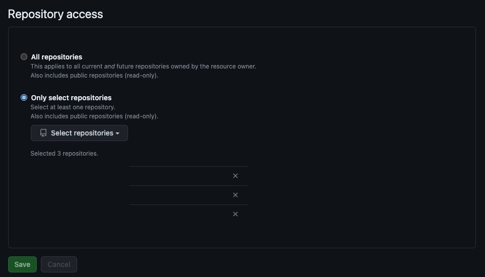
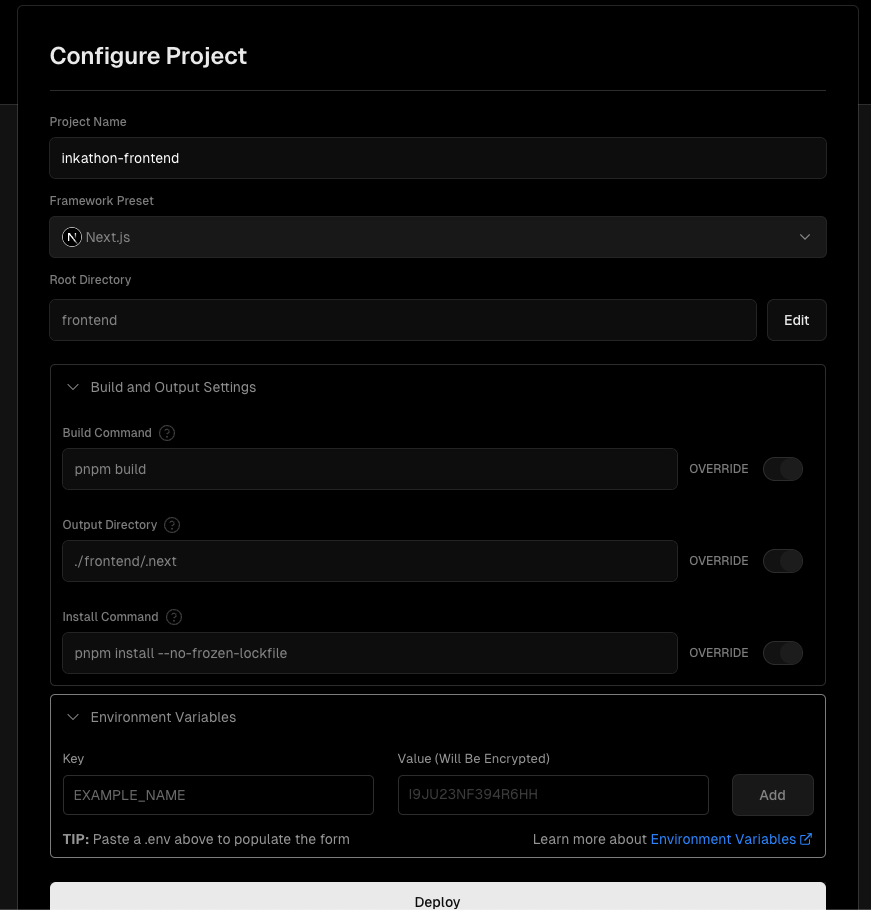
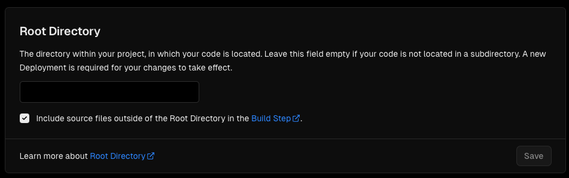
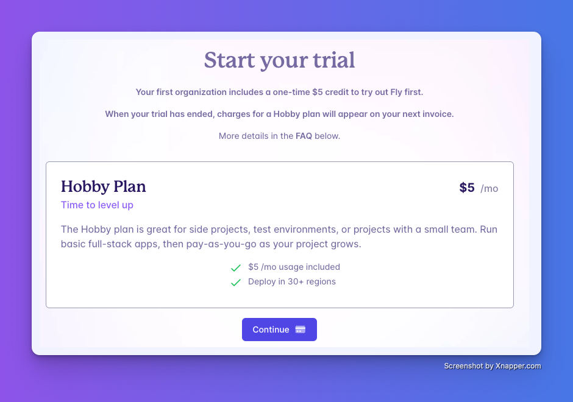
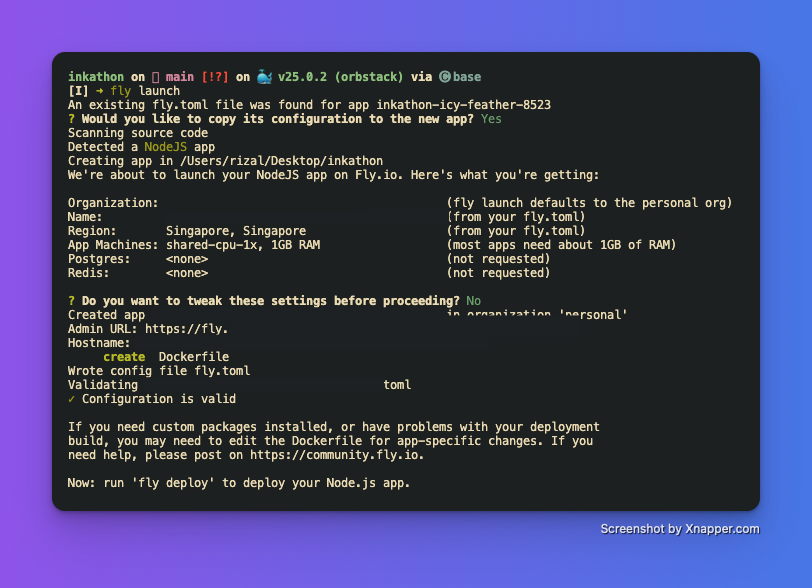
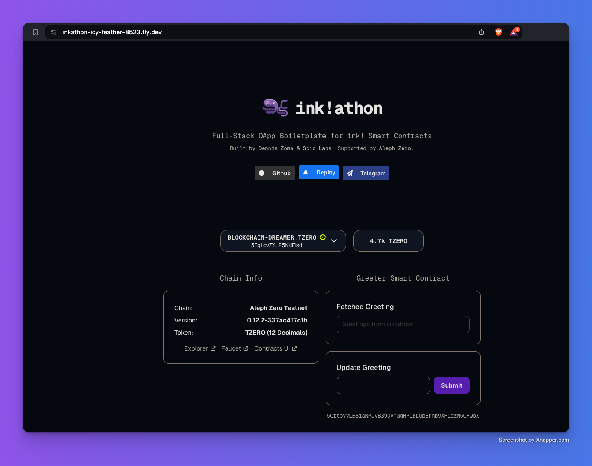

# Frontend deployment guide
## Deploying on Vercel
Since we are using Next.js to build the frontend, we can easily deploy it to production using Vercel platform. Follow the steps below to deploy your dApp on Vercel.

### Create a Vercel account
Go to [Vercel](https://vercel.com/signup) and create an account. Choose `Continue with GitHub` to link your GitHub account with the platform,
and go through with the sign up process.

### Import your `inkathon` repository
Once you are successfully signed up, import your `inkathon` repository on Vercel. You can do so on this [link](https://vercel.com/import/git).
First, install `Vercel for GitHub`. Then, either give access to `All repositories` or `Only select repositories` and select your `inkathon` repository to import it.



### Configure your ink!athon deployment
A `Configure Project` form will appear. 



You can leave the form as is -- it will use **pre-defined values** and Vercel will automatically detect that it is a Next.js app
and will set up optimal build settings for you. 

However, make sure that the `Root directory` field is empty (set to the root of monorepo), otherwise the build might fail.



Click on `Deploy` to continue.

Your Next.js app will start building. It will finish in a couple of minutes. When the deployment is done, you will get **deployment URLs**. Click on one of them to visit your app live.

Congratulations! Your dApp is now live on Vercel and publicly accessible.

## Deploying on a non-Vercel environment (using Docker image)
What if I want to deploy my dApp on a different platform, or if I want to wrap my dApp on a docker container? 

You can leverage the pre-built Docker image and deploy it to any platform that supports Docker.
For this, we will use [Fly.io](https://fly.io) as an example, since it natively supports Dockerised apps and is easy to use. However, you can use any platform with Docker support.

### Create a Fly.io account
Go to [Fly.io](https://fly.io/app/sign-up) and create an account if you haven't already. You can sign up using your GitHub or Google account. You'll need to add a payment method to deploy your app. 
Once you have added a payment method, your free trial will start. Don't worry, you won't be charged until your trial has ended.



### Install flyctl and sign in
`flyctl` is a command-line tool that you can use to manage your Fly.io apps. Download it from [here](https://fly.io/docs/getting-started/installing-flyctl/) and find the most suitable method for your OS.
Since we have already signed up, we can now sign in using `flyctl`. Run the following command and follow the instructions to sign in.

```bash
fly auth login
```

When your browser opens to the Fly.io sign-in screen, enter your user name and password to sign in. If you signed up with GitHub, then click Sign in with GitHub to sign in.

Either way, you will be returned to your command line, ready to use Fly.io.

### Launch your dApp on Fly.io
Before deploying our dApp, we need to do the setup to tell the system how to deploy it. Simply run:

```bash
fly launch
```

and the terminal will output something similar like below.



Now all you need to do is run the following command to deploy your dApp to Fly.io.

```bash
flyctl deploy --dockerfile ./Dockerfile.frontend
```

Wait until the image finishes building and it will be pushed to Fly.io. 
Once the deployment is done, go back to Fly.io dashboard and click on your app (e.g. in my case it is named `inkathon-icy-feather-8523`). 
Look for the hostname and click on it (e.g. `https://inkathon-icy-feather-8523.fly.dev`), you will see your dApp live!



